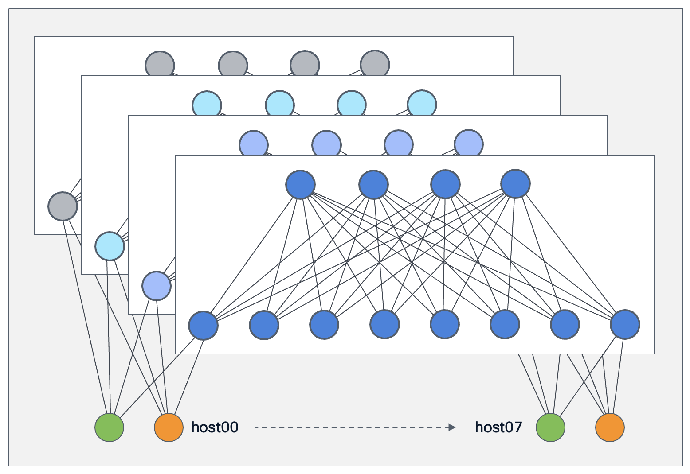

## Quickstart 4-Plane Containerlab Topology

The default 4-plane topology deploys with 4 spines and 8 leafs in each plane (48 dockerized sonic-vs routers total). It also deploys 16 light Alpine containers simulating hosts attached to the network. The Alpine containers are divided into tenants *`green`* and *`yellow`*, with one *`green`* and one *`yellow`* attached to each leaf.

Example: *`green-host00`* has 4 uplinks, one to *`leaf00`* in each of the 4 planes.



The **docker-sonic-vs** is pretty lightweight and takes up only 160MB of memory. That said, the lab has been tested on Ubuntu 22.04 and 24.04 virtual machines with 32 vCPU and 96GB of memory, which appears to be more than sufficient.

### Pre-requisites

1. Download a **docker-sonic-vs** image that supports SRv6 uSID shift-and-forward. The `Branch Master` version on the public sonic downloads page works well: [docker-sonic-vs.gz](https://artprodcus3.artifacts.visualstudio.com/Af91412a5-a906-4990-9d7c-f697b81fc04d/be1b070f-be15-4154-aade-b1d3bfb17054/_apis/artifact/cGlwZWxpbmVhcnRpZmFjdDovL21zc29uaWMvcHJvamVjdElkL2JlMWIwNzBmLWJlMTUtNDE1NC1hYWRlLWIxZDNiZmIxNzA1NC9idWlsZElkLzExMTc1MDIvYXJ0aWZhY3ROYW1lL3NvbmljLWJ1aWxkaW1hZ2UudnM1/content?format=file&subpath=/target/docker-sonic-vs.gz)

2. Install Containerlab: https://containerlab.dev/install/

3. Clone this repo
```bash
git clone https://github.com/segmentrouting/srv6-mrc-emulator.git
```

```bash
cd ./srv6-mrc-emulator
```

### Make (image, deploy, config, host-routes)

>[!Note]
> the `make` commands in the following section default to the 4-plane 8x16 spine-leaf topology. If you wish to work with another topology use `make TOPO=<topology-directory-name> deploy/config/etc.`
> Example `make TOPO=2p-4x8 deploy` will deploy the smaller 2-plane 4x8 spine-leaf topology

1. Build the Alpine-srv6-scapy docker image for our simulated hosts
```bash
make image
# equivalent to:
docker build -f host-image/Dockerfile \
             --build-arg TOPO=topologies/4p-4x8/topo.yaml \
             -t alpine-srv6-scapy:1.0 .
```

2. Deploy the topology
```bash
make deploy
# equivalent to:
sudo clab deploy -t topologies/4p-4x8/topology.clab.yaml
```
Other topologies can be deployed (and configured, etc.) by specifying TOPO=<topology>
```bash
make TOPO=2p-4x8 deploy 
```

3. Run `make config` to apply sonic *`config_db.json`* and *`frr.conf`* configs to each device (under `topologies/4p-4x8/config/`)
```bash
make config
# equivalent to:
scripts/config.sh all
```

It will take a minute or two for the script to run through the
fabric routers (48 on the default 4p-4x8, 96 on 4p-8x16)

```bash
============================================================
  sonic-docker-4p-4x8 — 4 planes x (4 spine x 8 leaf) SRv6 CLOS
============================================================
  Topology:     sonic-docker-4p-4x8 (from topology.clab.yaml)
  Config dir:   /home/cisco/srv6-mrc-emulator/topologies/4p-4x8/config
  Routing:      Controller-driven (no BGP, no IGP)
  Tenants:      green (uDT d000 -> Vrf-green on every leaf)
                yellow (host-based; uDT d001 seg6local on hosts)
============================================================

Configuration complete!
```

4. Install Green and Yellow Tenant Host Routes (useful for verifying paths/fabric-connectivity, etc.)
```bash
make host-routes
```

### Quick test - Tenant Green - Host SRv6 Encap, Egress Leaf SRv6 uDT
> [!Note]
> The host-routes script sets metrics such that ping tests will default to fabric plane-0

1. Run a ping from *`green-host00`* to *`green-host07`*
```bash
docker exec -it green-host00 ping 2001:db8:bbbb:7::2 -i .3
```

2. In another terminal session run tcpdump on the sonic nodes' interfaces along the path:

tcpdump Plane-0 Leaf00 (*`p0-leaf00`*) ingress from *`green-host00`*
```bash
docker exec -it p0-leaf00 tcpdump -ni Ethernet32
```

We expect to see encapsulated echo requests and plain ipv6 echo replies (post uDT decapsulation):
```bash
$ docker exec -it p0-leaf00 tcpdump -ni Ethernet32
tcpdump: verbose output suppressed, use -v[v]... for full protocol decode
listening on Ethernet32, link-type EN10MB (Ethernet), snapshot length 262144 bytes
17:16:39.628230 IP6 2001:db8:bbbb::2 > fc00:0:f003:e007:d000::: IP6 2001:db8:bbbb::2 > 2001:db8:bbbb:7::2: ICMP6, echo request, id 278, seq 11, length 64
17:16:39.628956 IP6 2001:db8:bbbb:7::2 > 2001:db8:bbbb::2: ICMP6, echo reply, id 278, seq 11, length 64
```

3. You can tcpdump along the entire path by following the uSID encapsulation pattern.

```
fc00:0:f003:e006:d000::
└──┬──┘└┬──┘└┬──┘└┬──┘
   │    │    │    └──── d000  : tenant-ID green leaf07 uDT Ethernet32
   │    │    └───────── e007  : spine03 uA Ethernet28 toward leaf07
   │    └────────────── f003  : leaf00 uA Ethernet8 toward spine03 
   └─────────────────── 0000  : plane 0 block
```
   
```bash
# p0-leaf00 egress to p0-spine03
docker exec -it p0-leaf00 tcpdump -ni Ethernet8

# p0-spine03 egress to p0-leaf07
docker exec -it p0-spine00 tcpdump -ni Ethernet28
```

### Quick test - Tenant Yellow - Host SRv6 Encap and Decap

1. Run a ping from *`yellow-host01`* to *`yellow-host14`* . Packet capture/tcpdump procedure is the same.
```bash
docker exec -it yellow-host01 ping 2001:db8:cccc:e::2 -i .3 
```

For other quick tests see the [spray-tool.md](./spray-tool.md)


## srctl command line utility
*`srctl`* is a simple CLI modeled after K8s `kubectl` and can be used to interact with the MRC-SRv6 emulator. 
`srctl's ` primary use is to run MRC traffic scenarios over the deployed topology.

1. Install `srctl` python packages
```bash
pip install -e . --user
```

2. Test `srctl` was installed
```bash
which srctl
```

If ~/.local/bin isn't in your PATH:
```bash
echo 'export PATH="$HOME/.local/bin:$PATH"' >> ~/.bashrc && source ~/.bashrc
```

3. `srctl` help
```bash
srctl --help
```

```bash
srctl get {topology,hosts,evs}
```

Example: `srctl get evs` <src-host> <dst-host>
```bash
srctl get evs green-host00 green-host07
```

```bash
$ srctl get evs green-host00 green-host07
PLANE  PATH  EV     SID                       
0      0     P0:S0  fc00:0000:f000:e007:d000::
0      1     P0:S1  fc00:0000:f001:e007:d000::
0      2     P0:S2  fc00:0000:f002:e007:d000::
<snip>
```

### srctl run - running MRC traffic scenarios:

1. List available scenarios for the active topology:
```bash
srctl run --list
```

Partial output
```bash
$ srctl run --list
green-all-to-all         # models all-to-all collective for tenant green
green-allreduce-ring     # models all-reduce collective ring for tenant green
green-mrc-baseline       # a generic 'pairs' traffic pattern with MRC probes to establish base functionality
green-mrc-ev-spray       # full path EV packet spray without 

yellow-all-to-all
yellow-allreduce-ring
yellow-mrc-baseline
yellow-mrc-ev-spray
```

2. Run one (just the scenario stem name, no .yaml):
```bash
srctl run yellow-mrc-baseline
```

3. Or with options:
```bash
srctl run yellow-allreduce-ring --verbose
```
```bash
srctl run green-mrc-baseline --dry-run
```
`srctl` auto-discovers scenarios under topologies/<active>/scenarios/ (where "active" is determined by _active_topo_dir(). If you have multiple topologies and want to be explicit, set TOPO=4p-4x8 srctl run … if it honors that, or check srctl get topology to see which one srctl thinks is active.

Quick sanity check to verify it sees your new topology:
```bash
srctl get topology
srctl run --list
```

>[!Note]
> When running any traffic scenario the MRC emulator sprays SRv6 encapsulated traffic across all available EVs (paths).
> You should be able to run tcpdump on any spine interface in the fabric and see some encapsulated traffic

```bash
docker exec -it p0-spine02 tcpdump -ni Ethernet8

docker exec -it p2-spine01 tcpdump -ni Ethernet20

# etc
```

### MRC traffic re-balance on failure

To see MRC rebalance on probe failure, shutdown a fabric interface prior to or while running one of the **mrc** scenarios:

>[!Note]
> docker-sonic-vs loses its interface ipv6 address after the shutdown procedure below. Until we have a workaround it is recommended to document the interface ip so you can re-add it after bringing the interface back up. Sorry about that.

1. Shutdown an interface - this example should produce a rebalance of the host00 to host15 flow away from the `plane-1-spine00` EV path
```bash
# get ipv6 address first
docker exec -it p1-spine00 ip addr show Ethernet0 | grep /127

# shutdown a link
docker exec -it p1-spine00 config interface shutdown Ethernet0
```

2. Run any of the *ev-spray* or collective scenarios (all-to-all, allreduce-ring, etc.) 
```bash
srctl run green-mrc-ev-spray
# etc.
```

3. You can run tcpdumps as before
4. Bring the interface back up and re-apply its ip
```bash
docker exec -it p1-spine00 config interface startup Ethernet0

docker exec -it p1-spine00 ip addr add <ip/mask> dev Ethernet0
```

### MRC traffic generation scenarios using `make`

1. Basic EV spray, no MRC state or failure detection
```bash
# Open-loop EV-spray (data-path validation, no MRC feedback, provides EV SRv6 encap list)
make scenario SCEN=green-ev-spray 
make scenario SCEN=yellow-ev-spray
```

2. Basic MRC scenarios
```bash
# Green MRC scenarios (all use health_aware_mrc)
make scenario SCEN=green-mrc-baseline        # 4 EVs/pair, 5s clean — sanity: MRC is no-op
make scenario SCEN=green-mrc-ev-spray        # 32 EVs/pair, 60s — manually shutdown a port to see rebalance
```

```bash
# Yellow MRC scenarios
make scenario SCEN=yellow-mrc-baseline       # same as green, host-decap data path
make scenario SCEN=yellow-mrc-ev-spray       # same as green-mrc-ev-spray, host-decap
```

 - Run tcpdumps anywhere in the fabric to see SRv6 encapsulated MRC (UDP port 9999) or probe (UDP port 9998) traffic:
```bash
docker exec -it p1-leaf00 tcpdump -ni Ethernet0
docker exec -it p1-leaf00 tcpdump -ni Ethernet4
docker exec -it p1-leaf00 tcpdump -ni Ethernet8
docker exec -it p1-leaf00 tcpdump -ni Ethernet12

docker exec -it p1-spine00 tcpdump -ni Ethernet60

# etc.
```

1. Built in failure/degradation scenarios:

```bash
make scenario SCEN=green-mrc-plane-loss      # 1% loss on plane 2 (netem fault)
make scenario SCEN=green-mrc-plane-latency   # +5ms on plane 2 (netem fault)

make scenario SCEN=yellow-mrc-plane-loss     # 1% loss on plane 2 (yellow)     
make scenario SCEN=yellow-mrc-plane-latency  # plane 2 +5ms (yellow)  
```

## Running a different topology

Each variant lives under `topologies/<name>/` with its own `topo.yaml`
declaring planes / spines / leaves / images / clab name. To run the
existing 2-plane variant:

```bash
make TOPO=2p-4x8 regen deploy config host-routes
make TOPO=2p-4x8 scenario SCEN=yellow-baseline
```

`make image` only needs to run once -- the same host image
(`alpine-srv6-scapy:1.0`) serves every topology, because each variant's
`topo.yaml` is bind-mounted into its host containers at runtime (via
the generated `topology.clab.yaml`). Inside a container, the runtime
reads `SRV6_TOPO=/etc/srv6_mrc/topo.yaml`. Outside containers (lab
host, dev box), it reads `topologies/<name>/topo.yaml` relative to the
repo root, picking the active variant from `TOPO=`.

To add a new variant, copy an existing `topologies/<name>/topo.yaml`,
adjust the dimensions, and run `make TOPO=<new> regen`. The generator
emits a fresh `topology.clab.yaml` plus per-node `config/` from
scratch.

## Testing

```bash
make test     # ~1.5s, no external deps
```